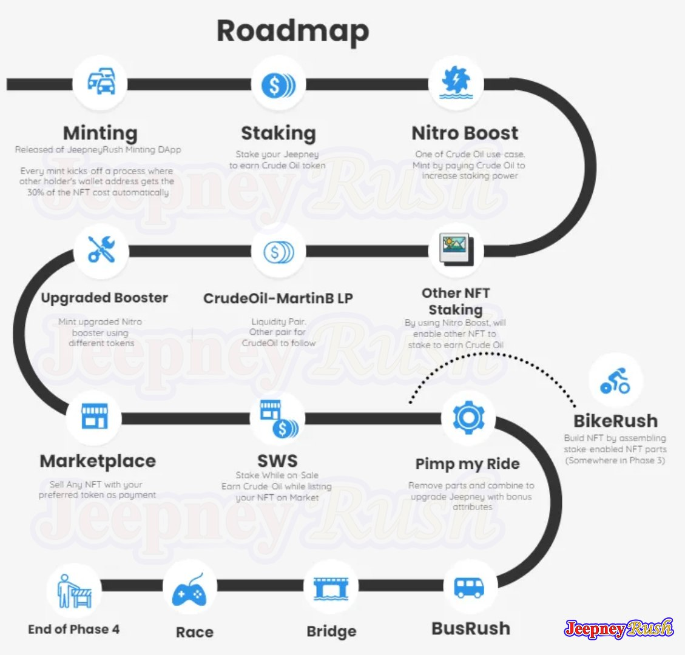

# 💸 Staking System

### RUSHDAPP

Users will be able to stake Jeepney Rush NFT and other SEP712 tokens, basically every NFTs on SmartBCH. By locking their NFTs into the vault, they earn interest in Crude Oil tokens as a reward.

&#x20;Crude Oil is the token for RushDApp, its use cases are: Mint Nitro, Liquidity Pair, Listing fee for Marketplace, can be used as payment to whitelist NFT staking, and more will be revealed soon.

### Roadmap

### There are 4 phases in the roadmap.

#### The 1st phase includes

* Minting of Jeepney Rush which is currently ongoing
* Staking - already deployed, you can stake any SEP712 NFTs regardless of it being abandoned or is currently active.
  * Initial Earning Rates:
    * Jeepney Rush - 100 Oil per day
    * All other NFTs - 25 Oil per day
* Nitro Boost - minted/bought with Crude Oil or other tokens such as MartinB, Knuth, ARG, TANGO. It is used to boost your rewards and enable NFT staking.
  * Different Nitro Boosts also have different effects on your staking, your reward multiplier and its duration or validity period depends on the token you used to mint Nitro Boost.
    * Reward rates based on type of Nitro:

| Nitro Type   | Price                 | Multiplier |
| ------------ | --------------------- | ---------- |
| Nitro CRUDE  | 700 Oil               | 2x         |
| Nitro MARTIN | 8,181,050,000 MartinB | 2.1x       |
| Nitro KTH    | 58, 821 KTH           | 2.2x       |
| Nitro ARG    | 112, 126, 000 ARG     | 2.2x       |
| Nitro TANGO  | 133.77 TANGO          | 2.3x       |

#### 2nd phase includes

Other NFT Staking. NitroBoost is required so you can stake and start earning, especially on the rugged NFT projects.

* Equipping of Nitro can be optional if the project owner requests or demands it.
* The project owner can pay or be provided with a rewarder address so they can send their own token as an alternative reward aside from Crude Oil. It’s called “staking-asa- service”.
* You don’t have to mint Nitro to staked Jeepney Rush and CryptoBug NFTs. If you equip them with Nitro, your reward rate will be boosted.

CrudeOil-MartinB LP - adding of liquidity on tangoswap.cash

Upgraded Booster

#### 3rd phase

* Marketplace for your NFTs where you can sell it for tokens you preferred to get as payment.
* Stake-While-On-Sale (SWS) - a function that allows you to sell or list your NFT up for an auction while still staking and earning rewards on the platform.
* Bike Rush NFT - upcoming fragmented NFT collection where you can assemble them yourself. Every part is stakeable.
  * _Fragmentation = splitting of an NFT into parts_
* Pimp My Ride - removing and combining of parts to upgrade your Jeepney Rush NFTs with bonus attributes

#### 4th phase

Bus Rush

Bridge

Racing Game


RushDApp Website Link: [https://rush-dapp.com](https://rush-dapp.com)

