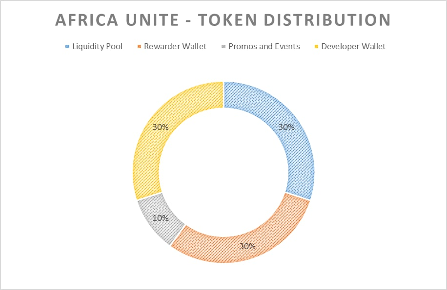

# 🍀 TOKEN

### Token Specification

Africa Unite token is a token built on SmartBCH sidechain.&#x20;

|                    |                                            |
| ------------------ | ------------------------------------------ |
| Token Name         | Africa Unite                               |
| Ticker             | MartinB                                    |
| Type               | SEP20                                      |
| Total Fixed Supply | 100, 000, 000, 000, 000                    |
| Token Contract     | 0x4ea4a00e15b9e8fee27eb6156a865525083e9f71 |

### &#x20;Token Allocation and Distribution&#x20;

As outlined in the token distribution, a total of 30% of the supply will be available to purchase directly on [TangoSwap](https://tangoswap.cash/) or [SmartSwap](https://smartswap.fi/swap?outputCurrency=0x4EA4A00E15B9E8FeE27eB6156a865525083e9F71). Another 30% will be distributed on Tango 2x Farm (Martin₿-BCH pair) and in the Tangoswap Token Rewarder address. 10% will be allotted for Incentives, Promotions and Events.

### Token Burn

Team has already burnt 30% of the total token supply from the accumulated tokens on Tango 2x Farm and dev wallet.

Token Burn Transaction: [https://www.smartscan.cash/transaction/0x85e480d752d36b29e8191f6d1bf87453cdef b3c25a7efd6afaef74aa82955187](https://www.smartscan.cash/transaction/0x85e480d752d36b29e8191f6d1bf87453cdefb3c25a7efd6afaef74aa82955187)&#x20;

Team plans to burn another 20% from the supply, making MartinB more scarce and more valuable.

