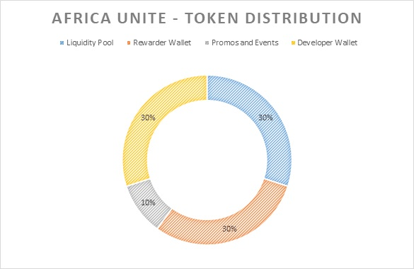

# 🪙 Martin₿ Tokenomics

A crypto project without sustainable tokenomics will be purposeless and disoriented.&#x20;

As outlined in the token distribution, a total of 30% of the supply will be available to purchase directly on [<mark style="color:orange;">https://tangoswap.cash</mark>](https://tangoswap.cash) or in [<mark style="color:orange;">https://smartswap.fi/swap?outputCurrency=0x4EA4A00E15B9E8FeE27eB6156a865525083e9F71</mark>](https://smartswap.fi/swap?outputCurrency=0x4EA4A00E15B9E8FeE27eB6156a865525083e9F71)<mark style="color:orange;">.</mark>&#x20;

Another 30% will be distributed on Tango 2x farm (Martin₿-BCH pair) and in the Tangoswap Token Rewarder address.&#x20;

10% will be allotted for Incentives, Promotions and Events.&#x20;

The remaining 30% will be used by the Africa Unite team to contribute to its evolution.

#### Detailed Specification

| Token Name       | <mark style="color:orange;">Africa Unite</mark>                                                                                                                |
| ---------------- | -------------------------------------------------------------------------------------------------------------------------------------------------------------- |
| Contract Address | [<mark style="color:orange;">0x4EA4A00E15B9E8FeE27eB6156a865525083e9F71</mark>](https://www.smartscan.cash/address/0x4ea4a00e15b9e8fee27eb6156a865525083e9f71) |
| Symbol           | <mark style="color:orange;">Martin₿</mark>                                                                                                                     |
| Total Supply     | <mark style="color:orange;">100,000,000,000,000</mark>                                                                                                         |

####

#### Token Distribution


Note: more news to be announced for the distribution breakdown especially on Developer wallet and the Promos & Events.&#x20;


